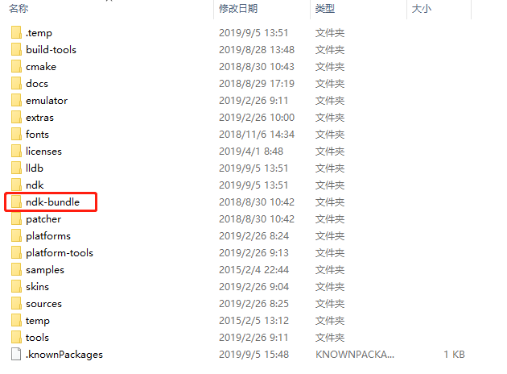
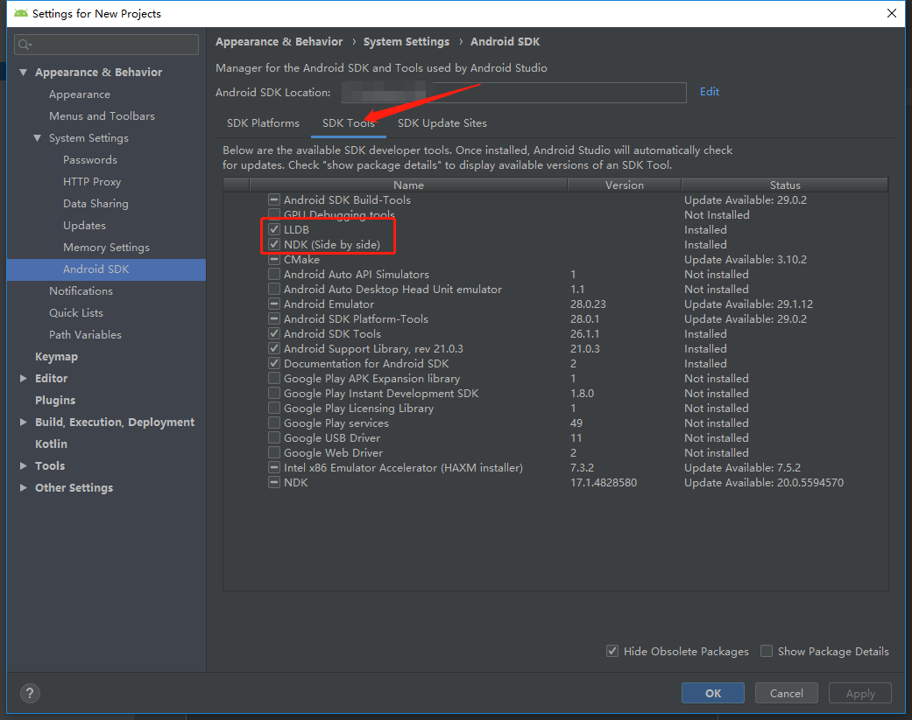
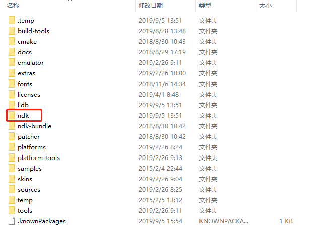
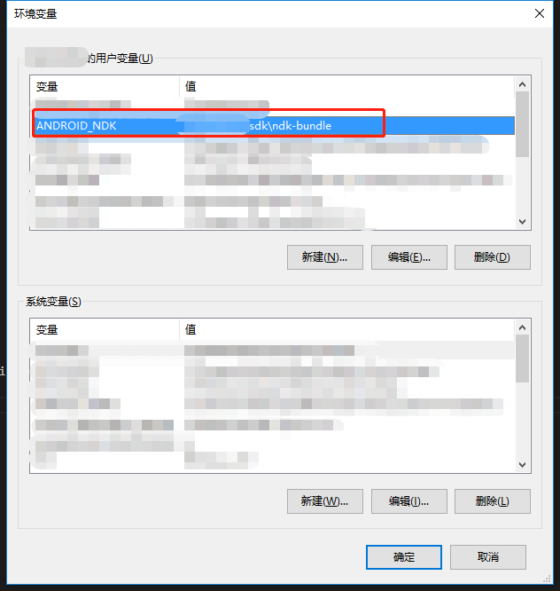
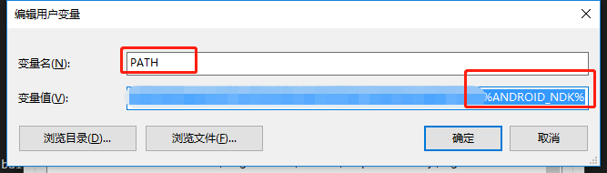
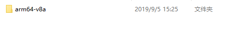

# Android Studio NDK 开发

记录在Android Studio中NDK简单开发的步骤

用到的Android Studio版本为3.5。

## 配置NDK

### 下载NDK

一般在SDK下已经有自带的ndk文件夹，如sdk目录下的ndk-bundle文件夹。



如果没有，可以在SDK Manager中下载



下载LLDB、NDK两项

下载完成后，可以在sdk目录下看到ndk的文件夹



### 配置环境变量

我的电脑-属性-高级系统设置-环境变量

新建一个ANDROID_NDK变量，配置上ndk文件夹的位置(在这个文件夹下可以看ndk-build.cmd等文件)



然后将这个变量加入到path变量中



## 生成SO库

新建一个Hello.java文件，里面增加一个本地方法

```java
public static native String hi();
```

执行Build-Make Project，在app\build\intermediates\javac\debug\classes目录下执行以下cmd命令生成头文件:

```cmd
javah -jni com.wangyz.ndk.Hello
```

在该目录下，可以看到生成的com_wangyz_ndk_Hello.h文件。

在app/src/main/目录下新建jni目录，将生成的头文件复制到jni目录下。

在jni目录下新建com_wangyz_ndk_Hello.c文件，编写C语言实现代码：

```c
#include "com_wangyz_ndk_Hello.h"

JNIEXPORT jstring JNICALL Java_com_wangyz_ndk_Hello_hi
  (JNIEnv *env, jclass clazz){
  return (*env)->NewStringUTF(env,"Hello");
  }
```

在jni目录下新建Android.mk文件，内容如下:

```mk
LOCAL_PATH := $(call my-dir)
include $(CLEAR_VARS)

LOCAL_MODULE := Hello
LOCAL_SRC_FILES := com_wangyz_ndk_Hello.c
include $(BUILD_SHARED_LIBRARY)
```

在jni目录下新建Application.mk文件，内容如下:

```mk
APP_ABI := all
```

在该目录下执行cmd命令:

```cmd
ndk-build
```

执行后生成所需的so文件。

## 引用SO库

在app/src/main目录下新建目录jniLibs,将对应的so复制到该目录下:



在Activity中引入：

```java
static {
        System.loadLibrary("Hello");
    }
```

使用SO库中的方法

```java
String hi = Hello.hi();
Toast.makeText(getApplicationContext(), hi, Toast.LENGTH_SHORT).show();
```

Android Studio中NDK的简单开发到此结束。