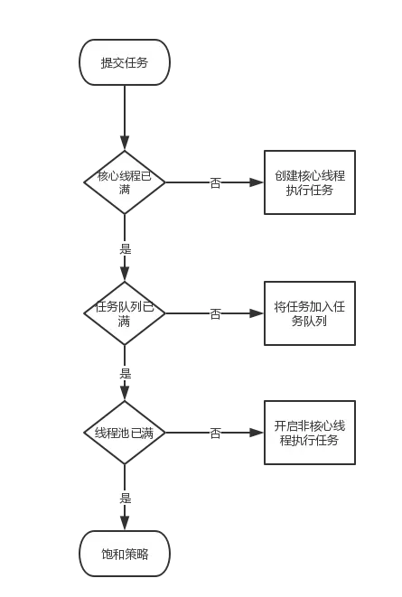

# Android中的线程池

在Android中，主线程不能执行耗时的操作，否则可能会导致ANR。那么，耗时操作应该在其它线程中执行。线程的创建和销毁都会有性能开销，创建过多的线程也会由于互相抢占系统资源而导致阻塞的现象。这个时候，就需要使用线程池。

线程池的优点可以概括为以下几点:

- 1、重用线程池中的线程，避免线程创建、销毁带来的性能开销；

- 2、能有效地控制线程池的最大并发数，避免大量的线程之间因互相抢占系统资源导致的阻塞现象；

- 3、能够对线程进行简单的管理。

> 以上线程池的优点引用自《Android开发艺术探索》

线程池的具体实现类为ThreadPoolExecutor，ThreadPoolExecutor继承自AbstractExecutorService,AbstractExecutorService又实现了ExecutorService接口，ExecutorService继承自Executor。

ThreadPoolExecutor有四个重载的构造方法：

```java
    public ThreadPoolExecutor(int corePoolSize,
                              int maximumPoolSize,
                              long keepAliveTime,
                              TimeUnit unit,
                              BlockingQueue<Runnable> workQueue) {
        this(corePoolSize, maximumPoolSize, keepAliveTime, unit, workQueue,
             Executors.defaultThreadFactory(), defaultHandler);
    }

	public ThreadPoolExecutor(int corePoolSize,
                              int maximumPoolSize,
                              long keepAliveTime,
                              TimeUnit unit,
                              BlockingQueue<Runnable> workQueue,
                              ThreadFactory threadFactory) {
        this(corePoolSize, maximumPoolSize, keepAliveTime, unit, workQueue,
             threadFactory, defaultHandler);
    }

	public ThreadPoolExecutor(int corePoolSize,
                              int maximumPoolSize,
                              long keepAliveTime,
                              TimeUnit unit,
                              BlockingQueue<Runnable> workQueue,
                              RejectedExecutionHandler handler) {
        this(corePoolSize, maximumPoolSize, keepAliveTime, unit, workQueue,
             Executors.defaultThreadFactory(), handler);
    }

	public ThreadPoolExecutor(int corePoolSize,
                              int maximumPoolSize,
                              long keepAliveTime,
                              TimeUnit unit,
                              BlockingQueue<Runnable> workQueue,
                              ThreadFactory threadFactory,
                              RejectedExecutionHandler handler) {
        if (corePoolSize < 0 ||
            maximumPoolSize <= 0 ||
            maximumPoolSize < corePoolSize ||
            keepAliveTime < 0)
            throw new IllegalArgumentException();
        if (workQueue == null || threadFactory == null || handler == null)
            throw new NullPointerException();
        this.corePoolSize = corePoolSize;
        this.maximumPoolSize = maximumPoolSize;
        this.workQueue = workQueue;
        this.keepAliveTime = unit.toNanos(keepAliveTime);
        this.threadFactory = threadFactory;
        this.handler = handler;
    }
```

最终都调用到了:

```java
    /**
     * Creates a new {@code ThreadPoolExecutor} with the given initial
     * parameters.
     *
     * @param corePoolSize the number of threads to keep in the pool, even
     *        if they are idle, unless {@code allowCoreThreadTimeOut} is set
     * @param maximumPoolSize the maximum number of threads to allow in the
     *        pool
     * @param keepAliveTime when the number of threads is greater than
     *        the core, this is the maximum time that excess idle threads
     *        will wait for new tasks before terminating.
     * @param unit the time unit for the {@code keepAliveTime} argument
     * @param workQueue the queue to use for holding tasks before they are
     *        executed.  This queue will hold only the {@code Runnable}
     *        tasks submitted by the {@code execute} method.
     * @param threadFactory the factory to use when the executor
     *        creates a new thread
     * @param handler the handler to use when execution is blocked
     *        because the thread bounds and queue capacities are reached
     * @throws IllegalArgumentException if one of the following holds:<br>
     *         {@code corePoolSize < 0}<br>
     *         {@code keepAliveTime < 0}<br>
     *         {@code maximumPoolSize <= 0}<br>
     *         {@code maximumPoolSize < corePoolSize}
     * @throws NullPointerException if {@code workQueue}
     *         or {@code threadFactory} or {@code handler} is null
     */
    public ThreadPoolExecutor(int corePoolSize,
                              int maximumPoolSize,
                              long keepAliveTime,
                              TimeUnit unit,
                              BlockingQueue<Runnable> workQueue,
                              ThreadFactory threadFactory,
                              RejectedExecutionHandler handler) {
        if (corePoolSize < 0 ||
            maximumPoolSize <= 0 ||
            maximumPoolSize < corePoolSize ||
            keepAliveTime < 0)
            throw new IllegalArgumentException();
        if (workQueue == null || threadFactory == null || handler == null)
            throw new NullPointerException();
        this.corePoolSize = corePoolSize;
        this.maximumPoolSize = maximumPoolSize;
        this.workQueue = workQueue;
        this.keepAliveTime = unit.toNanos(keepAliveTime);
        this.threadFactory = threadFactory;
        this.handler = handler;
    }
```

对应这个方法中的参数:

- **corePoolSize**:核心线程数。如果没有设置**allowCoreThreadTimeOut**为true，则核心线程空闲时也不会销毁。如果设置**allowCoreThreadTimeOut**为true,则受keepAliveTime控制，空闲时间超过keepAliveTime，会被回收。

- **maximumPoolSize**:最大线程数。

- **keepAliveTime**:非核心线程的空闲超时时长。超过这个时间，非核心线程会被回收。核心线程如果**allowCoreThreadTimeOut**为true,则在空闲超过这个时间也会被回收。

- **unit**:超时的单位。

- **workQueue**:线程池中的任务队列。通过线程池的execute()方法提交的Runnable任务会被放入任务队列中。

- **threadFactory**:线程工厂。

- **handler**:饱和策略。当任务队列和线程池都满后，对新提交的任务的处理策略。

ThreadPoolExecutor执行任务的规则:

- 1、**如果线程池中的线程数量未达到核心线程数量，则开启一个新的核心线程来执行任务**；

- 2、**如果线程池中的线程数量已经大于等于核心线程数量，则会把新的任务放入任务队列中**；

- 3、**如果任务队列已满，并且线程池中的线程未满，则开启非核心线程来处理新的任务**；

- 4、**如果任务队列和线程池都已满，则会交给handler饱和策略来处理**。




下面通过一个简单的案例来验证以上规则：

```java
    static class WorkThread implements Runnable {

		private String name;

		public WorkThread(String name) {
			this.name = name;
		}

		public void run() {
			try {
				Thread.sleep(5000);
				System.out.println("Thread: " + name + " work finish");
			} catch (Exception e) {
				e.printStackTrace();
			}

		}
	};

	Executor executor = new ThreadPoolExecutor(5, 100, 60, TimeUnit.SECONDS, new LinkedBlockingQueue<>(5));
		for (int i = 0; i < 20; i++) {
			WorkThread thread = new WorkThread("" + i);
			executor.execute(thread);
		}
```

定义了一个线程池，核心线程池数量为5，线程数量为100，超时时间为60秒，任务队列为5。在子线程中，sleep 5秒来模拟耗时的操作。然后开启了20个线程，并放入线程池中执行。执行的结果如下：

    Thread: 0 work finish
	Thread: 1 work finish
	Thread: 13 work finish
	Thread: 10 work finish
	Thread: 3 work finish
	Thread: 11 work finish
	Thread: 4 work finish
	Thread: 2 work finish
	Thread: 19 work finish
	Thread: 18 work finish
	Thread: 17 work finish
	Thread: 15 work finish
	Thread: 16 work finish
	Thread: 14 work finish
	Thread: 12 work finish
	Thread: 5 work finish
	Thread: 9 work finish
	Thread: 8 work finish
	Thread: 7 work finish
	Thread: 6 work finish

前五个线程在核心线程中执行，第6-10个线程由于核心线程已满，因此在任务队列中等待执行，第11-20个线程，由于核心线程和队列都已满，而线程池中还可以开启线程，因此在非核心线程中执行。从结果来看，线程0-4，10-19会先执行完，然后任务队列中的线程5-9才执行，验证了以上的线程池任务执行规则。

为便于使用线程池，线程池还有几种简便的定义方法：

```java
    public static ExecutorService newFixedThreadPool(int nThreads) {
        return new ThreadPoolExecutor(nThreads, nThreads,
                                      0L, TimeUnit.MILLISECONDS,
                                      new LinkedBlockingQueue<Runnable>());
    }

	public static ExecutorService newCachedThreadPool() {
        return new ThreadPoolExecutor(0, Integer.MAX_VALUE,
                                      60L, TimeUnit.SECONDS,
                                      new SynchronousQueue<Runnable>());
    }

	public static ExecutorService newSingleThreadExecutor() {
        return new FinalizableDelegatedExecutorService
            (new ThreadPoolExecutor(1, 1,
                                    0L, TimeUnit.MILLISECONDS,
                                    new LinkedBlockingQueue<Runnable>()));
    }

	public static ScheduledExecutorService newScheduledThreadPool(
            int corePoolSize, ThreadFactory threadFactory) {
        return new ScheduledThreadPoolExecutor(corePoolSize, threadFactory);
    }

	public ScheduledThreadPoolExecutor(int corePoolSize) {
        super(corePoolSize, Integer.MAX_VALUE, 0, NANOSECONDS,
              new DelayedWorkQueue());
    }
```

通过Executors的static方法来创建。其中:

- **FixedThreadPool**:线程数量固定的线程池。从方法的定义来看，这种线程池里的线程全都是核心线程，并且没有超时时间,任务队列也是没有限制的。

- **CachedThreadPool**:这种线程池没有核心线程，全是非核心线程，并且超时时间为60秒，任务队列没有限制。这种线程适合执行大量的耗时较短的任务。

- **SingleThreadExecutor**:只有一个核心线程，没有超时时间，任务队列没有限制。可以确保任务按顺序执行。

- **ScheduledThreadPool**:核心线程数量固定。非核心线程没有限制。非核心线程闲置时会被立即回收。这类线程池适合执行定时任务和具有固定周期的重复任务。