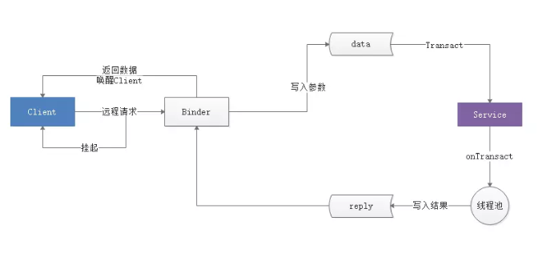
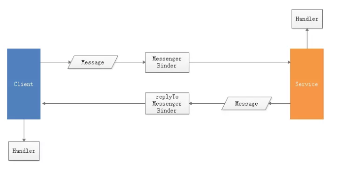

# IPC机制

## 1、Android IPC简介

> IPC是Inter-Process Communication的缩写，含义为进程间通信或者跨进程通信，是指两个进程之间进行数据交换的过程。

ANR:Application Not Responding,应用无响应。

## 2、Android中的多进程模式

在Android中使用多进程，可以通过给四大组件在AndroidMenifest中指定android:process属性。默认进程的进程名是包名。

```xml
<activity android:process=":remote"/>
<activity android:process="com.example.ipc.remote"/>
```

上述两种声明的区别：

> 首先，":"的含义是指要在当前的进程名前附加上当前的包名，即完整进程名为:com.example.ipc:remote,而第二种则为完整的命名方式。其次，进程名以":"开头的进程属于当前应用的私有进程，其它应用的组件不可以和它跑在同一个进程中，而进程名不以":"开头的进程属于全局进程，其它应用通过ShareUID方式可以和它跑在同一个进程中。

>Android系统会为每个应用分配一个唯一的UID，具有相同UID的应用才能共享数据。两个应用通过ShareUID跑在同一个进程，需要这两个应用有相同的ShareUID并且签名相同才可以。在这种情况下，它们可以互相访问对方的私有数据，比如data目录，组件信息等，不管他们是否跑在同一个进程中。如果在同一个进程中，还可以共享内存数据。

## 3、IPC基础概念

Serializable接口
>静态成员变量属于类不属于对象，所以不会参与序列化过程；用transient关键字标记的成员变量不参与序列化过程。
>
>可以通过重写writeObject和readObject方法去修改serialize的过程。

Parcelable接口

>一个类只要实现这个接口，就可以实现序列化并可以通过Intent和Binder传递。

Serializable是Java中的序列化接口，其使用起来简单但是开销很大，序列化和反序列化过程需要大量I/O操作。Parcelable是Android中的序列化方式，因此更适合在Android平台上，它的缺点是使用起来稍微麻烦，但是效率很高，这是Android推荐的序列化方式，因此首选Parcelable。Parcelable主要用在内存序列化上。如果要将对象序列化到存储设备或将对象序列化后通过网络传输，建议使用Serializable。

Binder

>首先，当客户端发起远程请求时，由于当前线程会被挂起直至服务端进程返回数据，所以如果一个远程方法是很耗时的，那么不能在UI线程中发起此远程请求；其它，由于服务端的Binder方法运行在Binder的线程池中，所以Binder方法不管是否耗时都应该采用同步的方式去实现，因为它已经运行在一个线程中了。



linkToDeath和unlinkToDeath

>Binder运行在服务端进程，如果服务端进程由于某些原因异常终止，这个时候我们到服务端的Binder连接断裂（称之为Binder死亡）,会导致我们的远程调用失败。如果我们不知道Binder连接已经断裂，那么客户端的功能就会受到影响。为了解决这个问题，Binder中提供了两个配对的方法linkToDeath和unlinkToDeath,通过linkToDeath，可以给Binder设置一个死亡代理，当Binder死亡时，我们就会收到通知，这个时候就可以重新发起连接请求从而恢复连接。具体设置代理的步骤如下：

```java
    private IBinder.DeathRecipient mDeathRecipient = new IBinder.DeathRecipient(){

        @override
		public void binderDied(){
			if(mBookManager==null){
				return;
			}
			mBookManager.asBinder().unlinkToDeath(mDeathRecipient,0);
			mBookManager=null;
			//TODO:重新绑定远程Service
		}
	}
```

在客户端绑定远程服务成功后，给binder设置死亡代理:
    mService = IMessageBoxManager.Stub.asInterface(binder);
	binder.linkToDeath(mDeathRecipient,0);

通过Binder的isBinderAlive方法可以判断Binder是否死亡。

## 4、Android中的IPC方式

- 使用Bundle
>Bundle实现了Parcelable接口，可以方便地在不同的进程间传输。传输的数据必须能被序列化，比如基本类型、实现了Parcelable接口的对象、实现了Serializable接口的对象以及一些Android支持的特殊对象。

- 使用文件共享

- 使用Messenger
>一次处理一个请求，因此在服务端不用考虑线程同步的问题，因为服务端中不存在并发执行的情形。




- 使用AIDL

AIDL支持的数据类型:
> 基本数据类型(int、long、char、boolean、double等)；

>String和CharSequence;

>List:只支持ArrayList,里面每个元素都必须能够被AIDL支持;

>Map:只支持HashMap,里面的每个元素都必须能够被AIDL支持，包括key和value;

>Parcelable:所有实现了Parcelable接口的对象;

>AIDL:所有的AIDL接口本身也可以在AIDL文件中使用。

以上6种数据类型就是AIDL所支持的所有类型，其中自定义的Parcelable对象和AIDL对象必须要显式import进来，不管它们是否和当前的AIDL文件位于同一个包内。

如果AIDL文件中用到了自定义的Parcelable对象，那么必须新建一个和它同名的AIDL文件，并在其中声明它为Parcelable类型。

AIDL中除了基本数据类型，其它类型的参数必须标上方向：in、out或者inout，in表示输入型参数，out表示输出型参数，inout表示输入输出型参数。

AIDL接口只支持方法，不支持声明静态常量。

为了方便AIDL开发，建议把所有和AIDL相关的类和文件全部放入同一个包中。AIDL的包结构在服务端和客户端要保持一致，否则运行会出错。这是因为客户端需要反序列化服务端中和AIDL接口相关的所有类，如果类的完整路径不一样的话，就无法成功反序列化，程序也无法正常运行。

CopyOnWriteArrayList支持并发读/写。

RemoteCallbackList是系统专门提供的用于删除跨进程listener的接口。RemoteCallbackList是一个泛型，支持管理任意的AIDL接口。

```java
    public class RemoteCallbackList<E extends IInterface>
```

在它的内部有一个Map结构专门用来保存所有的AIDL回调，这个Map的key是IBinder类型，value是Callback类型。

```java
    ArrayMap<IBinder,Callback> mCallbacks = new ArrayMap<IBinder,Callback>();
```

其中Callback封装了真正的远程listener。当客户端注册listener的时候，它会把这个listener的信息存入mCallbacks中，其中Key和value分别通过下面的方式获得：

```java
IBinder key = listener.asBinder();
Callback value = new Callback(listener,cookie);
```

当客户端解注册的时候，只要遍历服务端所有的listener,找出那个和解注册listener具有相同Binder对象的服务端listener并把它删除就可以了。当客户端进程终止后，RemoteCallbackList能够自动移除客户端所注册的listener。RemoteCallbackList内部自动实现了线程同步的功能，所以使用它来注册和解注册时，不需要做额外的线程同步工作。

使用RemoteCallbackList,有一点需要注意。我们无法像操作List一样去操作它，尽管它的名字中也带个List，但是它并不是一个List。遍历RemoteCallbackList，必须要按照下面的方式进行，其中beginBroadcast和finishBroadcast必须配对使用，哪怕我们仅仅是想要获取RemoteCallbackList的元素个数。

```java
    final int N = mListenerList.beginBroadcast();
	for(int i=0;i<N;i++){	
		IOnNewBookArrivedListener l = mListenerList.getBroadcastItem(i);
		if(l!=null){
			//TODO
		}
	}
	mListenerList.finishBroadcast();
```

AIDL中使用权限验证功能

>第一种方法：在onBind中进行验证，验证不通过就直接返回null。可以使用permission验证这种验证方式。先在AndroidMenifest中声明所需的权限。

>定义权限后，就可以在Service的onBind方法做权限验证。

```java
    public IBinder onBind(Intent intent){
		int check = checkCallingOrSelfPermission("xx.xx.xx");
		if(check==PackageManager.PERMISSION_DENIED){
			return null;
		}
		return mBinder;
	}
```

>第二种方法：可以在服务端的onTransact中进行权限验证，如果验证失败，就直接返回false,这样服务端就不会终止执行AIDL中的方法从而达到保护服务端的效果。可以验证permission,也可以验证Uid和Pid。

```java
    public boolean onTransact(int code,Parcel data,Parcel reply,int flags) throws RemoteException{
		int check = checkCallingOrSelfPermission("xx.xx.xx");
		if(check==PackageManager.PERMISSION_DENIED){
			return false;
		}
		String packageName = null;
		String[] packages = getPackageManager().getPackgesForUid(getCallingUid());
		if(packages!=null&&packages.length>0){
			packageName = packages[0];
		}
		if(!packageName.startWith("xx.xx")){
			return false;
		}
		return super.onTransact(code,data,reply,flags);
	}
```

- 使用ContentProvider

>ContentProvider的onCreate方法运行在主线程，其它query、getType、insert、delete、update方法运行在Binder线程池中。需要注意，query、update、insert、delete四大方法存在多线程并发访问，因此方法内部要做好线程同步。

- 使用Socket