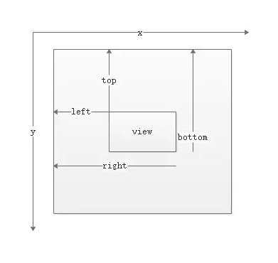
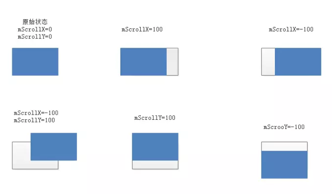

# View的事件体系

## 1、View基础知识

### 1.1、什么是View

View是Android中所有控件的基类。View是一种界面层的控件的一种抽象，代表了一个控件。除了View,还有ViewGroup，内部包含了许多个控件，即一组View。

### 1.2、View的位置参数

View的位置主要由它的四个顶点来决定，分别对应于View的四个属性：top、left、right、bottom，其中top是左上角纵坐标，left是左上角横坐标，right是右下角横坐标，bottom是右下角纵坐标。这些坐标都是相对于View的父容器来说的。是一种相对坐标。



> width = right - left
> 
> height = bottom - top

获取这四个参数的方法:

left=getLeft();

right=getRight();

top=getTop();

bottom=getBottom();

Android3.0开始，View增加了额外的几个参数:x、y、translationX和translationY,其中x和y是View左上角的坐标，而translationX和translationY是View左上角相对于父容器的偏移量。这几个参数也是相对于父容器的坐标，并且translationX和translationY的默认值为0.

>x=left+translationX

>y=top+translationY

View在平移的过程中，top和left表示的是原始左上角的位置信息，其值并不会发生改变，此时发生改变的是x、y、transaltionX和translationY这四个参数。



### 1.3、MotionEvent和ToushSlop

**MotionEvent**

在手指接触屏幕后产生的一系列事件中，典型的事件类型有如下几种:
>ACTION_DOWN--手指刚接触屏幕；
>
>ACTION_MOVE--手指在屏幕上移动；
>
>ACTION_UP--手指从屏幕上松开的瞬间。

通过MotionEvent可以获取点击事件发生的x和y坐标:getX/getY和getRawX/getRawY。getX/getY返回的是相对于当前View左上角的x和y坐标，而getRawX/getRawY返回的是相对于手机屏幕左上角的x和y坐标。

**TouchSlop**

TouchSlop是系统所能识别出来的被认为是滑动的最小距离。这是一个常量，和设备有关，不同设备上这个值可能是不同的，可通过如下方式获取这个常量：ViewConfiguration.get(getContext().getScaledTouchSlop())。这个常量定义在frameworks/base/core/res/res/values/config.xml文件中，"config_viewConfigurationTouchSlop"对应的就是这个常量的定义。

### 1.4、VelocityTracker、GestureDetector和Scroller

**VelocityTracker**

速度追踪，用于追踪手指在滑动过程中的速度，包括水平和竖直方向的速度。使用方法如下：

首先，在View的onTouchEvent方法中追踪当前单击事件的速度：

```java
	VelocityTracker velocityTracker = VelocityTracker.obtain();
	velocityTracker.addMovement(event);
```

接着，当我们先知道当前的滑动速度 时，可用如下方式来获得当前的速度:

```java
	velocityTracker.computeCurrentVelocity(1000);
	int xVelocity = (int) velocityTracker.getXVelocity();
	int yVelocity = (int) velocityTracker.getYVelocity();
```

最后，当不需要使用它的时候，需要调用clear方法来重置并回收内存：

```java
	velocityTracker.clear();
	velocityTracker.recycle();
```

速度=(终点位置-起点位置)/时间段

速度可以为负数，当手指从右往左滑时，水平方向速度即为负值。当手指从左往右滑时，水平方向速度即为正值。

**GestureDetector**

手势检测，用于辅助检测用户的单击、滑动、长按、双击等行为。使用方法如下：

首先，需要创建一个GestureDetector对象并实现OnGestureListener接口，根据需要还可以实现OnDoubleTapListener从而能够监听双击行为：

```java
    GestureDetector mGestureDetector = new GestureDetector(this);
	//解决长按屏幕后无法手动的问题
	mGestureDetector.setIsLongpressEnabled(false);
```

接着，接管目标View的onTouchEvent方法，在待监听的onTouchEvent方法中添加如下实现：
```java
	boolean consume = mGestureDetector.onTouchEvent(event);
	return consume;
```

如果只是监听滑动相关，可以自己在onTouchEvent中实现，如果要监听双击行为，可以使用GestureDetector。

**Scroller**
使用View的scrollTo/scrollBy方法来进行滑动时，其过程是瞬间完成的，这个没有过度效果的滑动，用户体验不好。这个时候可以使用Scroller来实现有过渡效果的滑动，其过程不是瞬间完成，而是在一定时间间隔内完成的。Scroller本身无法让View弹性滑动，它需要和View的computeScroll方法配合使用才能共同完成这个功能。使用方法：

```java
    Scroller mScroller = new Scroller(mContext);
	
	//缓慢滚到到指定位置
	private void smoothScrollTo(int destX,int destY){
		int scrollX = getScrollX();
		int delta = destX-scrollX;
		//1000ms内滑向destX,效果就是慢慢滑动
		mScroller.startScroll(scrollX,0,delta,0,1000);
		invalidate();
	}

	@Override
	public void computeScroll(){
		if(mScroller.computeScrollOffset()){
			scrollTo(mScroller.getCurrX(),mScroller.getCurrY());
			postInvalidate();
		}
	}
```

## 2、View的滑动

通过三种方式可以实现View的滑动：第一种是通过View本身提供的scrollTo/scrollBy方法来实现滑动；第二种是通过动画给View施加平移效果来实现滑动；第三种是改变View的LayoutParams使用View重新布局从而实现滑动。

### 2.1、使用scrollTo/scrollBy

scrollBy实际也是调用了scrollTo方法，它实现了基于当前位置的相对滑动，而scrollTo实现了基于所传递参数的绝对滑动。在滑动过程中，mScrollX的值总是等于View的左边缘和View内容左边缘在水平方向的距离,而mScrollY的值总等于View的上边缘和View内容上边缘在竖直方向的距离。scrollTo和scrollBy只能改变View内容的位置而不能改变View在布局中的位置。mScrollX和mScrollY的单位为像素，并且当View左边缘在View内容左边缘的右边时，mScrollX为正值，反之为负值；当View上边缘在View内容上边缘的下边时，mScrollY为正值，反之为负值。换句话说，如果从左向右滑动，那么mScrollX为负值，反之为正值；如果从上往下滑动，那么mScrollY为负值，反之为正值。

### 2.2、使用动画
使用动画，主要就是操作View的translationX和translationY属性，既可以采用View动画，也可以采用属性动画。

View动画是对View的影像做操作，它并不能真正改变View的位置参数，包括宽/高，并且如果希望动画后的状态得以保留还必须将fillAfter属性设置为true,否则动画完成后其动画结果会消失，View会瞬间恢复到动画前的状态。使用属性动画不会存在上述问题。

### 2.3、改变布局参数
改变布局参数，即改变LayoutParams。简单示例如下：

```java
	MarginLayoutParams params = (MarginLayoutParams)mButton.getLayoutParams();
	params.width += 100;
	params.leftMargin += 100;
	mButton.requestLayout();
	//或者mButton.setLayoutParams(params);
```

**各种滑动方式的对比**

> scrollTo/scrollBy:View提供的原生方法，可以比较方便地实现滑动效果并且不影响内部元素的单击事件。缺点：只能滑动View的内容，并不能滑动View本身。
> 
> 动画:如果是Android3.0以上并采用属性动画，那么这种方式没有明显的缺点；如果是使用View动画或者在Android3.0以下使用属性动画，均不能改变View本身的属性。如果动画元素不需要响应用户的交互，那么可以用动画来做滑动，否则不太适合。一些复杂的效果必须通过动画才能实现。
> 
> 改变布局:使用起来麻烦些，没有明显的缺点。适用于一些具有交互性的View。

## 3、弹性滑动

### 3.1、使用Scroller

Scroller本身并不能实现View的滑动，它需要配合View的computeScroll方法才能完成弹性滑动的效果，它不断地让View重绘，而每一次重绘距离滑动起始时间会有一个时间间隔，通过这个时间间隔Scroller就可以得出View当前的滑动位置，知道了滑动位置就可以通过scrollTo方法来完成View的滑动。View的每一次重绘都会导致View进行小幅度的滑动，而多次小幅度滑动就组成了弹性滑动，这就是Scroller的工作机制。

### 3.2、通过动画

### 3.3、使用延时策略

核心思想是通过发送一系统延时消息从而达到一种渐进式的效果。具体来说，可以使用Handler或View的postDelayed方式，也可以使用纯种的sleep方法。

## 4、View的事件分发机制

### 4.1、点击事件的传递规则

所谓点击事件的事件分发，其实就是对MotionEvent事件的分发过程，即当一个Motion产生了以后，系统需要把这个事件传递给一个具体的View，而这个传递的过程就是分发的过程。点击事件的分发过程由三个很重要的方法来共同完成：dispatchTouchEvent、onInterceptTouchEvent和onTouchEvent。

**public boolean dispatchTouchEvent(MotionEvent ev)**

用来进行事件的分发。如果事件能够传递给当前View，那么此方法一定会被调用，返回结果受当前View的onTouchEvent和下级View的dispatchTouchEvent方法的影响，表示是否消耗当前事件。

**public boolean onInterceptTouchEvent(MotionEvent event)**

在上述方法内部调用，用来判断是否拦截某个事件，如果当前View拦截了某个事件，那么在同一个事件序列当中，此方法不会被再次调用，返回结果表示是否拦截当前事件。

**public boolean onTouchEvent(MotionEvent event)**

在dispatchTouchEvent方法中调用，用来处理点击事件，返回结果表示是否消耗当前事件，如果不消耗，则在同一个事件序列中，当前View无法再次接收到事件。

上面三个方法的关系可以用以下伪代码表示:

```java
    public boolean dispatchTouchEvent(MotionEvent event){
		boolean consume = false;
		if(onInterceptTouchEvent(event)){
			consume = onTouchEvent(event);
		}
		else{
			consume = child.dispatchTouchEvent(event);
		}
		return consume;
	}
```

通过上述伪代码，可以大致了解点击事件的传递规则：对于一个根ViewGroup来说，点击事件产生后，首先会传递给它，这时它的dispatchTouchEvent就会被调用，如果这个ViewGroup的onInterceptTouchEvent方法返回true就表示它要拦截当前事件，接着事件就会交给这个ViewGroup处理，即它的onTouchEvent方法就会被调用；如果这个ViewGroup的onInterceptTouchEvent方法返回false，就表示它不拦截当前事件，这时当前事件就会继续传递给它的子元素，接着子元素的dispatchTouchEvent方法就会被调用，如此反复直到事件被最终处理。

当一个View需要处理事件时，如果它设置了OnTouchListener，那么OnTouchListener中的onTouch方法会被回调。这时事件如何处理还要看onTouch的返回值，如果返回false,则当前View的onTouchEvent方法会被调用；如果返回true,那么onTouchEvent方法将不会被调用。由此可见，给View设置的OnTouchListener,其优先级比onTouchEvent要高。在onTouchEvent方法中，如果当前设置的有OnClickListener，那么它的onClick方法会被调用。可以看出，平时我们常用的OnClickListener，其优先级最低，即处于事件传递的尾端。

当一个点击事件产生后，它的传递过程遵循如下顺序：Activity->Window->View，即事件总是先传递给Activity,Activity再传递给Window，最后Window再传递给顶级View。顶级View接收到事件后，就会按照事件分发机制去分发事件。如果一个View的onTouchEvent返回false,那么父容器的onTouchEvent将会被调用，依此类推。如果所有元素都不处理这个事件，那么这个事件将会最终传递给Activity处理，即Activity的onTouchEvent方法会被调用。

关于事件传递的机制，有以下结论：

> 1、同一个事件序列是指从手指接触屏幕的那一刻起，到手指屏幕的那一刻结束，在这个过程中所产生的一系统事件，这个事件序列以down事件开始，中间含有数量不定的move事件，最终以up事件结束。
> 
> 2、正常情况下，一个事件序列只能被一个View拦截且消耗。因为一旦一个元素拦截了某些事件，那么同一个事件序列的所有事件都会直接交给它处理，因此同一个事件序列中的事件不能分别由两个View同时处理，但是通过特殊手段可以做到，比如一个View将本该自己处理的事件通过onTouchEvent强行传递给其它View处理。
> 
> 3、某个View一旦决定拦截，那么这一个事件序列都只能由它来处理（如果事件序列能够传递给它的话），并且它的onInterceptTouchEvent不会再被调用。
> 
> 4、某个View一旦开始处理事件，如果它不消耗ACTION_DOWN事件（onTouchEvent返回了false),那么同一事件序列中的其他事件都不会再交给它来处理，并且事件将重新交由它的父元素去处理，即父元素的onTouchEvent会被调用。
> 
> 5、如果View不消耗除ACTION_DOWN以外的其它事件，那么这个点击事件会消失，此时父元素的onTouchEvent并不会被调用，并且当前View可以持续收到后续事件，最终这些消失的点击事件会传递给Activity处理。
> 
> 6、ViewGroup默认不拦截任何事件。
> 
> 7、View没有onInterceptTouchEvent方法，一旦有点击事件传递给它，它的onTouchEvent方法会被调用。
> 
> 8、View的onTouchEvent默认会消耗事件(返回true)，除非它是不可点击的(clickable和longClickable同时为false)。View的longClickable属性默认都为false,clickable属性要分情况，比如Button的clickable属性默认为true,而TextView的clickable属性默认为false。
> 
> 9、View的enable属性不影响onTouchEvent的默认返回值。哪怕一个View是disable状态的，只要它的clickable或者longClickable有一个true,那么它的onTouchEvent返回true。
> 
> 10、onClick会发生的前提是当前View是可点击的，并且收到了down和up的事件。
> 
> 11、事件传递过程是由外向内的，即事件总是先传递给父元素，然后再由父元素分发给子View，通过requestDisallowInterceptTouchEvent方法可以在子元素中干预父元素的事件分发过程，但是ACTION_DOWN事件除外。

### 4.2、事件分发的源码解析

#### 4.2.1、Activity对点击事件的分发过程

点击事件用MotionEvent来表示，当一个点击操作发生时，事件最先传递给当前Activity，由Activity的dispatchTouchEvent来进行事件派发，具体工作是由Activity内部的Window来完成的。Window会将事件传递给decor View,decor view一般就是当前界面的底层容器，即setContentView所设置的View的父容器,通过Activity.getWindow().getDecorView()可以获得。Activity的dispatchTouchEvent方法如下：

```java
    public boolean dispatchTouchEvent(MotionEvent event){
		if(event.getAction()==MotionEvent.ACTION_DOWN){
			onUserInteraction();
		}
		if(getWindow().superDispatchTouchEvent(event)){
			return true;
		}
		return onTouchEvent(event);
	}
```

首先，事件开始交给Activity所附属的Window进行分发，如果返回true，整个事件循环就结束了，返回false意味着事件没人处理，所有View的onTouchEvent都返回了false,那么Activity的onTouchEvent就会被调用。

接下来看Window是如何将事件传递给ViewGroup的。通过源码可以知道，Window是个抽象类，而Window的superDispatchTouchEvent方法也是个抽象方法，因此必须找到Window的实现类才行。**window的唯一实现类是PhoneWindow**。phoneWindow的superDispatchTouchEvent方法如下:

```java
    public boolean superDispatchTouchEvent(MotionEvent event){
		return mDecor.superDispatchTouchEvent(event);
	}
```

PhoneWindow将事件直接传递给了DecorView。通过((ViewGroup)getWindow().getDecorView().findViewById(android.R.id.content)).getChildAt(0)这种方式就可以获取Activity所设置的View,这个mDecor显示就是getWindow().getDecorView()返回的View,而我们通过setContentView设置的View是它的一个子View。

#### 4.2.1、顶级View对点击事件的分发过程

点击事件达到顶级View(一般是一个ViewGroup)以后，会调用ViewGroup的dispatchTouchEvent方法，然后的逻辑是这样的：如果顶级ViewGroup拦截事件即onInterceptTouchEvent返回true，则事件由ViewGroup处理，这时如果ViewGroup的mOnTouchListener被设置，则onTouch会被调用，否则onTouchEvent会被调用，也就是说，如果都提供的话，onTouch会屏蔽掉onTouchEvent。在onTouchEvent中，如果设置了mOnClickListener，则onClick会被调用。如果顶级ViewGroup不拦截事件，则事件会传递给它所在的点击事件链上的子View.这时子View的dispatchTouchEvent会被调用 。到此为止，事件已经从顶级View传递给了下一层View。接下来的传递过程和顶级View是一致的，如此循环，完成整个事件的分发。

**ViewGroup对点击事件的分发过程：**

主要实现在ViewGroup的dispatchTouchEvent方法中。描述了当前View是否拦截点击事件的逻辑。

```java
    final boolean intercepted;
	if(actionMasked==MotionEvent.ACTION_DOWN||mFirstTouchTarget!=null){
		final boolean disallowIntercept = (mGroupFlags&FLAG_DISALLOW_INTERCEPT)!=0;
		if(!disallowIntercept){
			intercepted=onInterceptTouchEvent(event);
			event.setAction(action);
		}
		else{
			intercepted = false;
		}
	}
	else{
		intercepted = true;
	}
```

ViewGroup在如下两种情况下会判断是否拦截当前事件：事件类型为ACTION_DOWN或者mFirstTouchTarget!=null。当事件由ViewGroup的子元素成功处理时，mFirstTouchTarget会被赋值并指向子元素，即：当ViewGroup不拦截事件并将事件交由子元素处理时，mFirstTouchTarget!=null。反过来，一旦事件由当前ViewGroup拦截时，mFirstTouchTarget！=null就不成立。那么当ACTION_MOVE和ACTION_UP事件到来时，由于(actionMasked==MotionEvent.ACTION_DOWN||mFirstTouchTarget!=null)这个条件为false，将导致ViewGroupr onInterceptTouchEvent不会再被调用，并且同一序列中的其他事件都会默认交给它处理。

还有种特殊情况，那就是FLAG_DISALLOW_INTERCEPT标记位，这个标记位是通过requestDisallowInterceptTouchEvent方法来设置的，一般用于子View中。这个标记一旦设置后，ViewGroup将无法拦截除了ACTION_DOWN以外的其它点击事件。总结起来两点:第一点，onInterceptTouchEvent方法并不是每次事件都被调用，如果想提前处理所有的点击事件，要选择dispatchTouchEvent方法，只有这个方法确保每次会调用，当然前提是事件能够传递到当前的ViewGroup；另外一点，FLAG_DISALLOW_INTERCEPT标记位的作用，可以在滑动冲突时，可以用这种方法去解决问题。

首先遍历ViewGroup的所有子元素，然后判断子元素是否能够接收点击事件。是否能够接收点击事件，主要由两点来衡量：子元素是否在播动画和点击事件的坐标是否落在子元素的区域内。如果子元素满足这两个条件，那么事件就会传递给它来处理。

**View的事件处理:**

首先判断有没有设置OnTouchListener，如果OnTouchListener中的onTouch方法返回true,那么onTouchEvent就不会被调用，可见OnTouchListener的优先级高于onTouchEvent，这样的好处是方便在外界处理点击事件。

接下来，看onTouchEvent的实现。当View处于不可用状态下时，照样会消耗点击事件。如果View设置有代理，还会执行TouchDelegate的onTouchEvent方法。

通过setClickable和setLongClickable会分别改变View的CLICKABLE和LONG_CLICKABLE属性。setOnClickListener会自动将View的CLICKABLE设为true,setOnLongClickListener会自动将View的LONG_CLICKABLE设为true。

## 5、View的滑动冲突

### 5.1、常见的滑动冲突场景

常见滑动冲突场景可以简单分为如下三种：

- 场景1--外部滑动方向和内部滑动方向不一致

- 场景2--外部滑动方向和内部滑动方向一致

- 场景3--上面两种情况的嵌套


### 5.2、滑动冲突的处理规则

对于场景1，根据滑动是水平滑动还是竖直滑动来判断到底由谁来拦截事件。

对于场景2，根据业务规则来决定由谁拦截事件。

对于场景3，根据业务规则来决定由谁拦截事件。

### 5.3、滑动冲突的解决方式

**1、外部拦截法**

点击事件都先经过父容器的拦截处理，如果父容器需要此事件就拦截，如果不需要此事件就不拦截，这样就可以解决滑动冲突的问题，这种方法比较符合点击事件的分发机制。外部拦截法需要重写父容器的onInterceptTouchEvent方法，在内部做相应的拦截即可。伪代码如下：

```java
    public boolean onInterceptTouchEvent(MotionEvent event){
		boolean intercepted = false;
		int x = (int)event.getX();
		int y = (int)event.getY();
		switch(event.getAction()){
			case MotionEvent.ACTION_DOWN:{
				intercepted = false;
				break;
			}
			case MotionEvent.ACTION_MOVE:{
				if(父容器需要当前的点击事件){
					intercepted = true;
				}
				else{
					intercepted = false;
				}
				break;
			}
			case MotionEvent.ACTION_UP:{
				intercepted = false;
				break;
			}
			default:
				break;
		}
		mLastXIntercept = x;
		mLastYIntercept = y;
		return intercepted;
	}
```

**2、内部拦截法**

内部拦截法是指父容器不拦截任何事件，所有的事件都传递给子元素，如果子元素需要此事件，就直接消耗掉，否则就交由父容器进行处理，这种方法和Android中的事件分发机制不一致，需要配合requestDisallowInterceptTouchEvent方法才能正常工作，作用起来较外部拦截法稍显复杂。我们需要重写子元素的dispathTouchEvent方法，伪代码如下：

```java
    public boolean dispatchTouchEvent(MotionEvent event){
		boolean intercepted = false;
		int x = (int)event.getX();
		int y = (int)event.getY();
		switch(event.getAction()){
			case MotionEvent.ACTION_DOWN:{
				parent.requestDisallowInterceptTouchEvent(true);
				break;
			}
			case MotionEvent.ACTION_MOVE:{
				int deltaX = x - mLastX;
				int deltaY = y - mLastY;
				if(父容器需要当前的点击事件){
					parent.requestDisallowInterceptTouchEvent(false);
				}
				break;
			}
			case MotionEvent.ACTION_UP:{
				break;
			}
			default:
				break;
		}
		mLastX = x;
		mLastY = y;
		return super.dispatchTouchEvent(event);
	}
```

除了子元素需要做处理以外，父元素也要默认拦截除了ACTION_DOWN以外的其它事件，这样当子元素调用parent.requestDisallowInterceptTouchEvent(false)方法时，父元素才能继续拦截所需的事件。父元素修改如下:

```java
	public boolean onInterceptTouchEvent(MotionEvent event){
		int action = event.getAction();
		if(action==MotionEvent.ACTION_DOWN){
			return false;
		}
		else{
			return true;
		}
	}
```