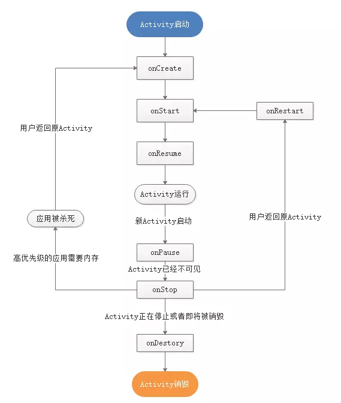
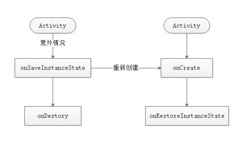

# Activity的生命周期和启动模式

## 1、Activity的生命周期

### 1.1、典型情况下的生命周期

> 在有用户参与的情况下，Activity所经过的生命周期的改变。

**Activity会经历如下生命周期:**

onCreate-onRestart-onStart-onResume-onPause-onStop-onDestroy



### 1.2、异常情况下的生命周期

> Activity被系统回收或者由于当前设备的Configuration发生改变从而导致Activity被销毁重建。



#### 1.2.1资源相关的系统配置发生改变导致Activity被杀死并重新创建

系统只在Activity异常终止的时候才会调用onSaveInstanceState和onRestoreInstanceState来存储和恢复数据，其它情况不会触发这个过程。

#### 1.2.2资源内存不足导致低优先级的Activity被杀死

Activity优先级:

1、前台Activity--正在和用户交互的Activity，优先级最高。

2、可见但非前台Activity--Activity可见但位于后台无法和用户直接交互，如Activity中弹出一个对话框。

3、后台Activity--已经被暂停的Activity，比如执行了onStop，优先级最低。

> 当系统内存不足时，系统会按照上述优先级去杀死目标Activity所在的进程，并在后续通过onSaveInstanceState和onRestoreInstanceState来存储和恢复数据。如果一个进程中没有四大组件在执行，那么这个进程将很快被系统杀死，因此，一些后台工作不适合脱离四大组件而独立运行在后台中，这样进程容易被杀死。比较好的方法是将后台工作放入Service中从而保证进程有一定的优先级，这样就不会轻易被系统杀死。

## 2、Activity的启动模式

1、standard:标准模式。

> 每次启动一个Activity都会重新创建一个新的实例，不管这个实例是否已经存在。

2、singleTop:栈顶复用模式。

> 如果新Activity已经位于任务栈的栈顶，那么此Activity不会被重新创建，同时它的onNewIntent方法会被回调，通过此方法的参数，我们可以取出当前请求的信息。此时，Activity的onCreate、onStart不会被系统调用，因为它并没有发生改变。如果新Activity的实例已存在但不是位于栈顶，那么新的Activity仍然会重新创建。

3、singleTask:栈内复用模式。

> 这是一种单实例模式。在这种模式下，只要Activity在一个栈中存在，那么多次启动此Activity都不会重新创建实例，和singleTop一样，系统也会回调onNewIntent。当一个具有singleTask模式的Activity请求启动后，比如Activity A,系统首先会寻找是否存在A想要的任务栈，如果不存在，就重新创建一个任务栈，然后创建A的实例后把A放入栈中。如果存在A所需的任务栈，这时要看A是否在栈中有实例存在，如果有实例存在，那么系统会把A调到栈顶并调用它的onNewIntent方法，如果实例不存在，就创建A的实例并把A放入栈中。singleTask默认具体有clearTop的效果，会导致栈内所有在A上的Activity全部出栈。

> TaskAffinity:任务相关性。这个参数标识了一个Activity所需要的任务栈的名字。默认情况下，所有Activity所需的任务栈的名字为应用的包名。我们也可以为每个Activity都单独指定TaskAffinity属性，这个属性值必须不能和包名相同，否则就相当于没有指定。TaskAffinity属性主要和singleTask启动模式或者allowTaskReparenting属性配对使用，在其它情况下没有意义。

4、singleInstance:单实例模式。

> 这是一种加强的singleTask模式，它除了具有singleTask模式的所有特性外，还加强了一点，那就是具有此种模式的Activity只能单独地位于一个任务栈中。

可以通过AndroidMenifest为Activity指定启动模式。或者通过Intent中设置标志位来为Activity指定启动模式。这两种方式都可以为Activity指定启动模式，但是二者还是有区别。首先，优先级上，第二种方式的优先级要高于第一种；其它，上述两种方式在限定范围上有所不同，第一种方式无法直接为Activity设定FLAG_ACTIVITY_CLEAR_TOP标识，而第二种方式无法为Activity指定singleInstance模式。

## 3、IntentFilter的匹配规则

> 启动Activity分为两种：显示调用和隐式调用。显示调用需要明确地指定启动对象的组件信息，包括包名和类名，而隐式调用则不需要明确地指定组件信息。隐式调用需要Intent能够匹配目标组件的IntentFilter所设置的过滤信息，如果不匹配将无法启动目标Activity。IntentFilter中的过滤信息有action、category、data。

>为了匹配过滤列表，需要同时匹配过滤列表中的action、category、data信息，否则匹配失败。只有一个Intent同时匹配action类别、category类别、data类别才算完全匹配，只有完全匹配才能启动目标Activity。一个Activity中可以有多个intent-filter，一个Intent只要能匹配任务一组intent-filter即可成功启动对应的Activity。

### 1、action的匹配规则

>一个过滤规则中可以有多个action，那么只要Intent中的action能够和过滤规则中的任务一个action相同即可匹配成功。action的匹配要求Intent中的action存在且必须和过滤规则中的其中一个aciton相同。

### 2、category的匹配规则

>如果Intent中含有category，那么所有的category必须和过滤规则中的其它一个category相同。Intent中可以没有category,如果没有category的话，系统在调用startActivity或者startActivityForResult的时候会默认为Intent加上"android.intent.category.DEFAULT"这个category。同时，为了我们的activity能够接收隐式调用，就必须在intent-filter中指定"android.intent.category.DEFAULT"这个category。

### 3、data的匹配规则

>data由两部分组成，mineType和URI。mimeType指媒体类型，比如image/jpeg、audio/mpeg4-generic和video/*等，可以表示图片、文本、视频等不同的媒体格式。而URI包含的数据就比较多了，下面是URI的结构：
>
>scheme://host:port/path|pathPrefix|pathPattern
>
>具体的例子如：
>
>http://www.baidu.com:80/search/info
>
>content://com.example.project:200/folder/subfolder/etc

Scheme:URI的模式，比如http、file、content等。如果URI中没有指定scheme，那么整个URI的其它参数无效，也意味着URI是无效的。

Host:URI的主机名。比如:www.baidu.com。如果URI中没有指定host，那么整个URI的其它参数无效，也意味着URI是无效的。

Port：URI中的端口号，如80，仅当URI中指定了scheme和host参数，port参数才有意义。

Path、pathPattern、pathPrefix:这三个参数表述路径信息，其中path表示完整的路径信息；pathPattern也表示完整的路径信息，但是它里面可以包含通配符"*","*"表示0个或多个任意字符，需要注意的是，由于正则表达式的规则，如果想表示真实的字符串，那么"*"要写成"\\*","\"要写在"\\\\";pathPrefix表示路径的前缀信息。

>如果要为Intent指定完整的data，必须要调用setDataAndType方法。不能先调用setData再调用setType。因为这两个方法彼此会清除对方的值。

>当我们通过隐式方式启动一个Activity的时候，可以做一下判断，看是否有Activity能够匹配我们的隐式Intent。如果不做判断就有可能出现错误。判断方法有两种：采用PackageManager的resolveActivity方式或者Intent的resolveActivity方法，如果找不到匹配的Activity会返回null。另外，PackageManager还提供了queryIntentActivities方法，这个方法和resolveActivity方法不同的是：它不是返回最佳匹配的Activity信息，而是返回所有成功的Activity信息。

```java
public abstract List<ResolveInfo> queryIntentActivities(Intent intent,int flags);

public abstract ResolveInfo resolveActivity(Intent intent,int flags);
```

上面两个方法的第二个参数，需要使用MATCH_DEFAULT_ONLY标记位。这个标记的含义是仅仅匹配那些在intent-filter中声明了<category android:name="android.intent.category.DEFAULT" />这个category的Activity.使用这个标记位的意义在于，只要上述两个方法不返回null,那么startActivity一定可以成功。