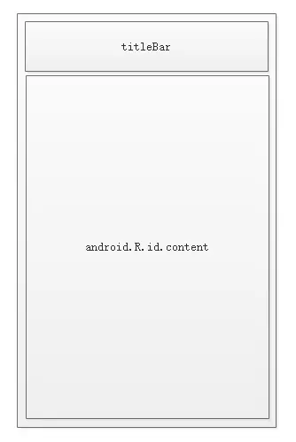
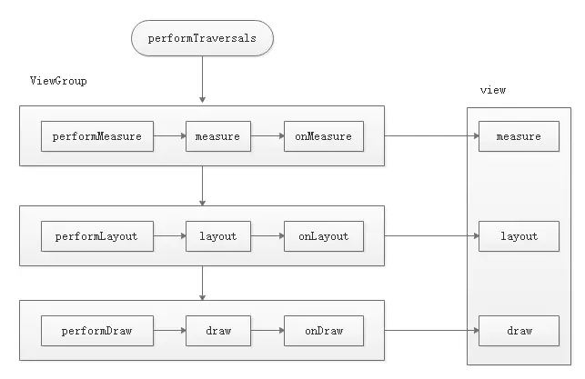

# View的工作原理

## 1、ViewRoot和DecorView

ViewRoot对应于ViewRootImpl类，它是连接WindowManager和DecorView的纽带，View的三大流程均是通过ViewRoot来完成的。在ActivityThread中，当Activity对象被创建完毕后，会将DecorView添加到Window中,同时会创建ViewRootImpl对象，并将ViewRootImpl对象和DecorView建立关联。

View的绘制流程是从ViewRoot的performTraversals方法开始的，它经过measure、layout和draw三个过程才最终将一个View绘制出来。

measure过程决定了View的宽/高，Measure完成以后，可以通过getMeasuredWidth和getMeasuredHeight方法来获取View测量后的宽/高，在几乎所有的情况下，它等同于View的最终的宽/高，但是特殊情况除外。Layout过程决定了View的四个顶点的坐标和实际的宽/高，完成以后，可以通过getTop、getBottom、getLeft和getRight来拿到View的四个顶点的位置，可以通过getWidth和getHeight方法拿到View的最终宽/高。Draw过程决定了View的显示，只有draw方法完成后View的内容才能呈现在屏幕上。

DecorView作为顶级View，一般情况下，它内部会包含一个竖直方向的LinearLayout，在这个LinearLayout里面有上下两个部分，上面是标题栏，下面是内容栏。在Activity中，我们通过setContentView所设置的布局文件其实就是被加到内容栏中的，而内容栏id为content。可以通过下面方法得到content:ViewGroup content = findViewById(R.android.id.content)。通过content.getChildAt(0)可以得到设置的view。DecorView其实是一个FrameLayout,View层的事件都先经过DecorView，然后才传递给我们的View。

## 2、MeasureSpec

MeasureSpec代表一个32位的int值，高2位代表SpecMode,低30位代表SpecSize,SpecMode是指测量模式，而SpecSize是指在某种测量模式下的规格大小。

SpecMode有三类，如下所示：

**UNSPECIFIED**

>父容器不对View有任何限制，要多大给多大，这种情况一般用于系统内部。

**EXACTLY**

>父容器已经检测出View所需要的精确大小，这个时候View的最终大小就是SpecSize所指定的值，对应于LayoutParams中的match_parent和具体的数值这两种模式。

**AT_MOST**

>父容器指定一个可用大小即SpecSize，View的大小不能大于这个值，对应于LayoutParams中的wrap_content。

LayoutParams需要和父容器一起才能决定View的MeasureSpec，从而进一步决定View的宽/高。对于顶级View，即DecorView和普通View来说，MeasureSpec的转换过程略有不同。对于DecorView，其MeasureSpec由窗口的尺寸和其自身的LayoutParams共同确定；对于普通View，其MeasureSpec由父容器的MeasureSpec和自身的Layoutparams共同决定，MeasureSpec一旦确定，onMeasure就可以确定View的测量宽/高。

当View采用固定宽/高时，不管父容器的MeasureSpec是什么，View的MeasureSpec都是精确模式并且大小遵循LayoutParams中的大小。当View的宽/高是match_parent时，如果父容器的模式是精准模式，那么View也是精准模式并且其大小是父容器的剩余空间；如果父容器是最大模式，那么View也是最大模式并且大小不会超过父容器的剩余空间。当View的宽/高是wrap_content时，不管父容器的模式是精准还是最大化，View的模式总是最大化并且大小不超过父容器的剩余空间。

## 3、View的工作流程

View的工作流程主要是指measure、layout、draw三大流程，即测量、布局、绘制。

### 3.1、measure过程

measure过程要分情况，如果只是一个原始的view，则通过measure方法就完成了其测量过程，如果是一个ViewGroup，除了完成自己的测量过程外，还会遍历调用所有子元素的measure方法，各个子元素再递归去执行这个流程。

**View的measure过程**

直接继承View的自定义控件需要重写onMeasure方法并设置wrap_content时的自身大小，否则在布局中使用wrap_content就相当于使用match_parent。

**ViewGroup的measure过程**

ViewGroup并没有定义其测量的具体过程，因为ViewGroup是一个抽象类，其测量过程的onMeasure方法需要各个子类去具体实现。

View的measure是三大流程中最复杂的一个，measure完成后，通过getMeasuredWidth/Height方法就可以正确获取到View的测量宽/高，但在某些极端情况下，系统可能会多次measure才能确实最终端的测量宽/高，建议在onLayout方法去获取View的测量宽/高或者最终宽/高。

在Activity已启动的时候获取View的宽/高：

**1、Activity/View#onWindowFocusChanged**

View已经初始化完毕，宽/高已经准备好了。onWindowFocusChanged会被调用多次，当Activity的窗口得到焦点和失去焦点均会被调用一次。

**2、view.post(runnable)**

通过post可以将一个runnable投递到消息队列的尾部，然后等Looper调用此消息的时候，View也已经初始化好了。

**3、ViewTreeObserver**

使用OnGlobalLayoutListener接口，当View树的状态发生改变或者View树内部的View的可见性发生改变时，onGlobalLayout方法会回调。onGlobalLayout会调用多次。

**4、view.measure(int widthMeasureSpec,int heightMeasureSpec)**

### 3.2、layout过程

Layout的作用是ViewGroup用来确定子元素的位置，当ViewGroup的位置被确定后，它在onLayout中会遍历所有子元素并调用其layout方法，在layout方法中onLayout方法又会被调用。

### 3.3、draw过程

View的绘制过程遵循如下几步:

- 1、绘制背景-background.draw(canvas)

- 2、绘制自己-onDraw

- 3、绘制children-dispatchDraw

- 4、绘制装饰-onDrawScrollBars

## 4、自定义View

### 4.1、自定义View的分类

- **继承View重写onDraw方法**

用于实现一些不规则的图形。采用这种方式需要自己支持wrap_content,并且padding也需要自己处理。

- **继承ViewGroup派生特殊的Layout**

主要用于实现自定义的布局，需要合理处理ViewGroup的测量、布局这两个过程，并同时处理子元素的测量和布局过程。

- 继承特定的View(如TextView)

一般用于扩展某种已有的View的功能，比如TextView，这种方法比较容易实现。不需要自己支持wrap_content和padding等。

- 继承特定的ViewGroup(如LinearLayout)

这种方法不用自己处理ViewGroup的测量和布局这两个过程。